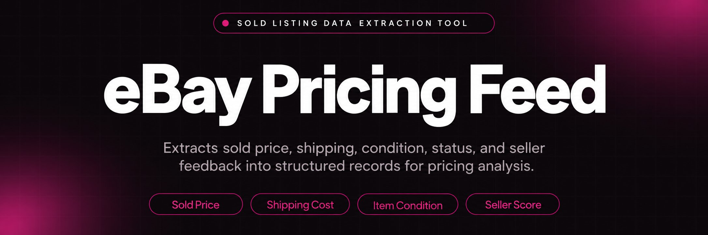
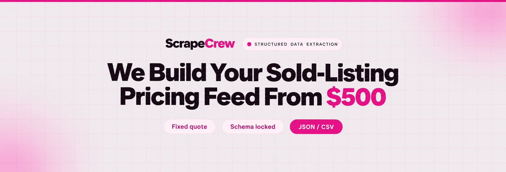
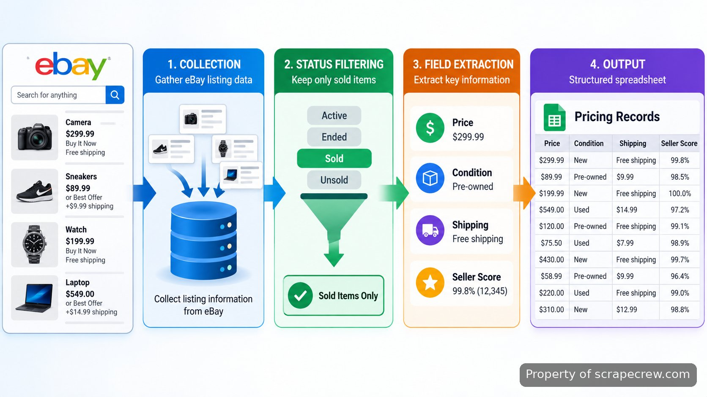

<p align="center">
  <a href="https://www.scrapecrew.com/scraper/ebay-price-scraper-change-detection" target="_blank" rel="nofollow">
    
  </a>
</p>

## ScrapeCrew's ebay scraping tool

ScrapeCrew's ebay scraping tool is built for resellers who need a reliable view of completed marketplace activity before setting their own prices. The system collects sold listing records, separates actual sale outcomes from unsold or ended listings, and returns structured records that can be reviewed in a pricing spreadsheet.

> Turn sold marketplace activity into structured pricing records.

Pricing an inventory item from active listings alone creates a common problem: asking prices do not always represent what buyers actually paid. The workflow focuses on sold price, item condition, shipping cost, seller feedback score, and listing status so a reseller can compare like-for-like products instead of relying on incomplete listing pages.

<a href="https://www.scrapecrew.com/scraper/ebay-price-scraper-change-detection" target="_blank" rel="nofollow">
  
</a>

<p align="center">
  <a href="https://t.me/Bitbash333" target="_blank" rel="nofollow">
    
  </a>&nbsp;
  <a href="https://wa.me/923249868488?text=Hi%2C%20I%27m%20interested%20in%20ScrapeCrew." target="_blank" rel="nofollow">
    
  </a>&nbsp;
  <a href="mailto:hello@scrapecrew.com" target="_blank" rel="nofollow">
    
  </a>&nbsp;
  <a href="https://www.scrapecrew.com" target="_blank" rel="nofollow">
    
  </a>
</p>



## Sold listings contain the pricing signals sellers need

For a reseller, the useful record is not simply a product title and a displayed price. A completed marketplace transaction needs context. A pair of shoes sold for $120 with free shipping is a different pricing reference from the same item sold for $120 plus $18 shipping. The total buyer cost changes the comparison.

The collection process captures the fields that affect a resale decision:

- Sold price: the amount recorded for the completed transaction rather than the seller's current asking price.
- Listing status: distinguishes sold items from ended listings that did not complete a sale.
- Item condition: separates new, used, refurbished, and other marketplace condition labels.
- Shipping cost: includes delivery charges because the buyer's total cost affects market value.
- Seller feedback score: adds seller context when comparing marketplace records.

## Why marketplace pages need careful extraction

Marketplace pages change based on listing type, device layout, and timing. Auction listings can move through different states as the closing time passes, while variation listings may contain several products under one parent page. A record that ignores those differences can mix unrelated products into the same pricing analysis.

The system handles these cases by reading the page structure, validating the fields being collected, and preserving the relationship between the item details and the transaction state. It also accounts for differences between mobile and desktop page structures, where the same information may appear in different document sections.

## Structured data extraction built around one pricing workflow

The output is designed for a reseller who wants to move from marketplace research to a repeatable pricing process. Instead of copying individual listings, the workflow produces records that can be loaded into a spreadsheet, reviewed by category, and compared over time.

A typical record contains values such as:

```json
{
  "title": "Example product title",
  "status": "sold",
  "sold_price": 120,
  "shipping_cost": 0,
  "condition": "used",
  "seller_feedback_score": 98
}
```

The structured output makes it possible to maintain price history instead of checking isolated listings. The same record format can be reviewed after new collection runs to see how completed sales are changing.

<a href="https://tally.so/r/BzWjZQ?platform=GitHub&amp;format=Product+repo&amp;brand=ScrapeCrew&amp;niche=scraping&amp;page=ebay+scraping+tool+from+eBay+Listings&amp;date=2026-09-14" target="_blank" rel="nofollow">
  
</a>

## Core Features

| Feature | Description |
| --- | --- |
| Sold Status Filtering | The problem with marketplace research is mixing completed sales with inactive listings. The system separates sold records from other listing states before they enter the final dataset. |
| Listing Fields Collection | The problem with manual checks is missing important details. The extractor captures item condition, price, shipping, and seller information in consistent fields. |
| Price History Records | The problem with one-time snapshots is losing previous market context. The workflow stores collected values so pricing changes can be reviewed over time. |
| CSV Export | The problem with isolated browser research is moving data into existing spreadsheets. The output can be exported into structured rows for pricing analysis. |
| Change Detection | The problem with repeated checks is manually finding what changed. The system identifies updated listing data between collection runs. |

## Use Cases

- Resellers compare recent completed transactions before listing used inventory, using sold prices and conditions from similar products.
- Marketplace operators review category-level pricing movement by collecting consistent records instead of relying on manual searches.
- Dropshippers track competitor inventory signals by monitoring listing changes, shipping details, and seller information.
- Collectors evaluate item value by comparing completed sales with condition details and historical records.

## How to Track Listings Using ScrapeCrew's ebay scraping tool

- **STEP 1 — Download & Set Up the Project**
Download and set up <a href="https://www.scrapecrew.com/scraper/ebay-price-scraper-change-detection" target="_blank" rel="nofollow">ScrapeCrew's ebay scraping tool</a> to access the prepared project structure.
- **STEP 2 — Open the Collection Panel**
Open the dashboard, select the marketplace collection screen, and review available input fields for tracked product searches.
- **STEP 3 — Configure Listing Filters**
Enter product queries, select sold listing filters, and confirm fields such as condition, shipping, and seller details.
- **STEP 4 — Run Collection and Export**
Start the collection run and receive structured records through CSV export for spreadsheet review and pricing updates.

## Project Structure

```text
ebay-pricing-project/
├── src/
│   ├── collector.py
│   ├── parser.py
│   └── validators.py
├── config/
│   ├── fields.json
│   └── settings.json
├── exports/
│   └── records.csv
└── README.md
```

## Technical approach behind the collection process

The project uses browser-based extraction methods where page rendering is required and structured parsing where the required fields are available directly. Browser automation with Playwright is used when dynamic page elements must load before collection. Documentation for the framework is available through <a href="https://playwright.dev/docs/intro" target="_blank" rel="nofollow">Playwright documentation</a>.

The parser keeps extraction rules separate from collection logic so field changes can be handled without rewriting the entire workflow. Validation checks confirm that important values such as sold status and price fields are present before records move into the export stage.

The project also follows marketplace access requirements. Automated collection must respect platform rules, request limits, and available APIs where applicable. eBay provides developer resources describing available interfaces through <a href="https://developer.ebay.com/api-docs/static/rest-request-components.html" target="_blank" rel="nofollow">eBay Developers documentation</a>.

## Working with marketplace limits

Automated access to marketplace pages requires attention to usage policies. eBay's terms and technical controls can change, so collection workflows should be reviewed against current platform rules before production use. The system is designed around responsible requests, accurate parsing, and respecting restrictions applied to automated activity.

For larger workflows, data handling practices should also consider privacy and storage requirements. The project separates collected marketplace information from internal pricing decisions, keeping the extracted records focused on the fields required for resale analysis.

ScrapeCrew also handles related work such as <a href="https://www.scrapecrew.com/contact" target="_blank" rel="nofollow">web scraping customization</a> and deployment changes when a workflow needs additional fields, monitoring, or connections to existing systems.

## FAQ

## FAQ

### How does the scraper handle eBay sold listings?

The scraper separates sold records from other listing states before creating the final dataset. It collects completed transaction details such as sold price, condition, shipping cost, and seller information so pricing decisions are based on completed marketplace activity.

### Can the extracted records include shipping costs and seller information?

Yes. The extracted records include shipping values and seller context such as feedback score when those fields are available on the listing. These details help compare total buyer cost instead of only the displayed item amount.

### What output format does the scraper provide?

The workflow provides structured records that can be exported as CSV files. The format is designed for spreadsheet-based pricing review and can preserve historical values for later comparison.

<table>
  <tr>
    <td align="center" width="33%">
      
      <p>This scraper helped me gather thousands of posts effortlessly. The setup was fast, and exports are super clean and well-structured.</p>
      <p><b>Nathan Pennington</b><br>Marketer<br>★★★★★</p>
    </td>
    <td align="center" width="33%">
      
      <p>What impressed me most was how accurate the extracted data is. Likes, comments, timestamps — everything aligns perfectly.</p>
      <p><b>Greg Jeffries</b><br>SEO Affiliate Expert<br>★★★★★</p>
    </td>
    <td align="center" width="33%">
      
      <p>It's by far the best tool I've used. Ideal for trend tracking, competitor monitoring, and influencer insights.</p>
      <p><b>Karan</b><br>Digital Strategist<br>★★★★★</p>
    </td>
  </tr>
</table>